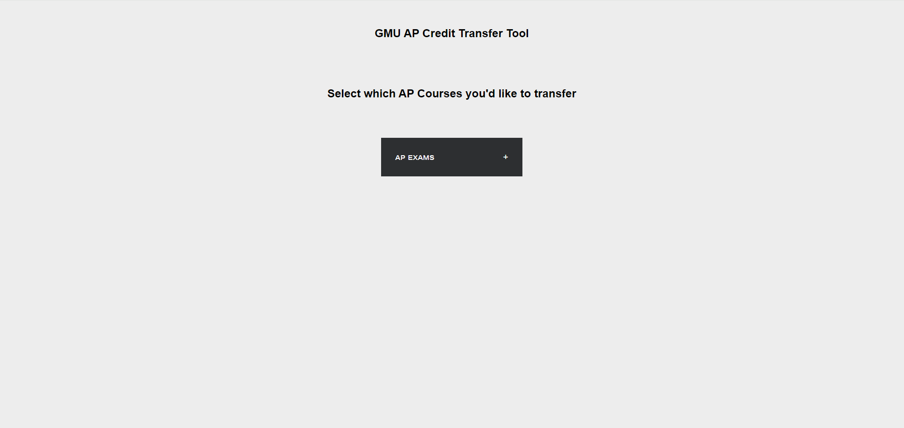

## George Mason University AP Credit Transfer Tool
A simple flask application incoming George Mason students can use to quickly calculate how many credits they will receive from their AP Exam scores

## Setting up the Web-App Locally 

1. Clone The Repository

2. Install Requirements  `pip install -r requirements.txt`

3. To run the app on localhost run `python app.py`

4. app is running at `http://127.0.0.1:5000`

#### Link to GMU transfer credit guide: <https://www.gmu.edu/freshman/requirements/exam-credit>

## WebApp 
#### Home Page 

